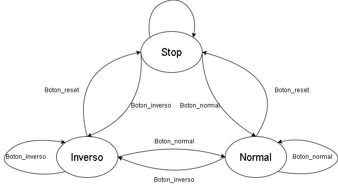

# Control básico de salidas digitales y aplicación avanzada con FSM

Este repositorio documenta el desarrollo de la práctica 2: **Control básico de salidas digitales y aplicación avanzada con FSM**, utilizando el **Controllino Mega** como plataforma de automatización y el entorno **Arduino IDE** para la programación.

La práctica se divide en dos partes:

- **Parte A**: Control de una matriz de LEDs en forma de espiral mediante tres botones físicos.
- **Parte B**: Simulación de un sistema de semáforos coordinados mediante una Máquina de Estados Finita (FSM).

---

## 🛠️ Requisitos

- **Controllino Mega** con conexión USB
- **Arduino IDE** configurado con la librería oficial de Controllino:
  [https://www.controllino.com/board-library-setup-in-arduino-ide/](https://www.controllino.com/board-library-setup-in-arduino-ide/)
- Cable USB tipo B
- Tablero de control con LEDs y botones precableados

---

## 🚦 Parte A - Control de LEDs en Espiral

Se controla una matriz 3x3 de LEDs con tres botones:

- Botón 1: activa secuencia espiral en sentido horario.
- Botón 2: activa secuencia espiral en sentido antihorario.
- Botón 3: reinicia y apaga todos los LEDs.
- La figura muestra la maquina de estados para esta parte
- 

### Características técnicas:
- Uso de punteros y arreglos para el manejo de salidas.
- FSM definida mediante `enum` y `struct`.
- Temporización no bloqueante con `millis()`.

---

## 🚥 Parte B - Simulación de Semáforo FSM

Simulación de dos semáforos perpendiculares que alternan el paso de forma coordinada.

### Estados definidos:
- A\_VERDE → A\_AMARILLO → B\_VERDE → B\_AMARILLO
- La figura muestra la maquina de estados para esta parte
- 

### Características:
- Exclusión de luces verdes simultáneas.
- Transiciones cronometradas.
- Código modular y reutilizable con funciones `setEstado()` y `apagarSemaforo()`.

---

## 📚 Referencias

- [Controllino Mega - Página oficial](https://www.controllino.com/)
- [Guía del tablero de control (PDF del docente)](https://drive.google.com/...)
- [Documentación FSM en C++](https://en.cppreference.com/w/cpp/language/enum)

---

## ✍️ Autores

Erick Ramón - Martin Vinces
Estudiantes de Ingeniería en Telecomunicaciones.
Proyecto realizado para el curso de Contról Digital.

---

## 📄 Licencia

Este proyecto se distribuye con fines educativos. El contenido puede ser reutilizado con la debida atribución.
